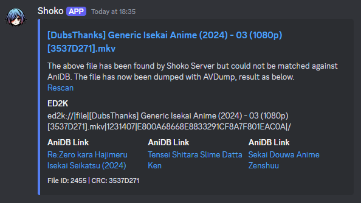
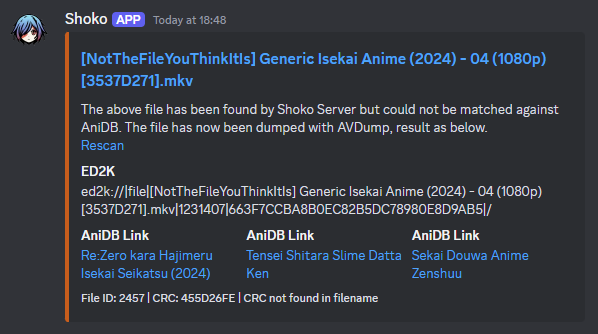
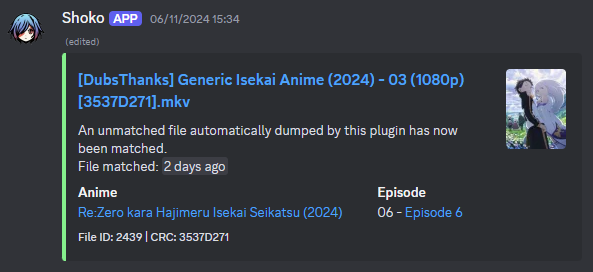

# What is this?
This is a [Shoko](https://shokoanime.com/) plugin, originally built for my own convenience (so forgive me if anything doesn't
make sense). It can do a few different things, all described in the [features](#features) section below.

>[!CAUTION]
> AniDB maintains their own set of requirements on what files are permissible to add to their database.\
> The detailed criteria for this can be found [here](https://wiki.anidb.net/Content:Files#What_is_accepted?).
>
> It _is_ currently permissible to AVDump any file, even if they should not be added as a file on AniDB itself.
>
> When adding AVDump'd files to AniDB, the three main prohibited types of files are:
> 1. **Private/Personal files** (e.g. re-encoded/transcoded versions of a file)
> 2. **Corrupted files** _(Only letting Shoko see files **after** they've fully finished downloading should prevent
> this)_
> 3. **Remuxed files**, unless published by a 'known' remux group
>
> Generally speaking, you will **not** encounter any problems if you are adding files that are **readily available
> as-is** to the masses, especially if other people are likely to check if the file is already recognised on AniDB.

# Features
At a glance:
- Automatic AVDumping of unmatched files
- Automatically have Shoko try to re-match files
- Send a message to discord when Shoko discovers a file and is unable to match it (and later edit that same message once
  the file has been matched).

## Automatic AVDumping
For this to work, you need to be able to AVDump from Shoko normally. See the
[official documentation](https://docs.shokoanime.com/shoko-server/settings#login-options) for more info on getting this
setup.

## Automatic file matching
If this feature is enabled, the plugin will, up to a configurable number of times, try to get Shoko to match a file
against AniDB again (and again... and again...). Please note that this feature **will** increase the risk of getting
an AniDB ban _(temporary)_ – See the [official documentation](https://docs.shokoanime.com/shoko-server/understanding-anidb-bans)
for more info.

For the standard automatic re-matching, the plugin will wait an exponentially increasing amount of time before it
requests that Shoko searches for matches. By default, this will be active for up to ~39 hours per file, attempting to
find a match eight different times.

### Reaction watcher (Subfeature)
If both the webhook and the reaction watcher features are enabled, the plugin will automatically check if the message
sent to discord has any reactions on it once every fifteen minutes. If there is a reaction found on the message, it will
have Shoko re-scan the file for a match. Please note that the file will be _indefinitely_ checked every fifteen minutes
for a match, so expect an (eventual and temporary) AniDB ban if the file doesn't match after reacting to the discord
message.

(This subfeature only exists, despite its flaws, so you can trigger a re-scan of a file from outside your normal network).

## Discord Webhooks
If enabled (and configured correctly), the plugin will send a message (or 'webhook') to discord when Shoko discovers a
file and is unable to match it. Once the file is eventually matched, the message that's sent will be edited to reflect
that Shoko now knows what the file is.

>[!NOTE]
> The plugin relies on the `CRC32` hasher being enabled in Shoko. The plugin will automatically turn this on if it's not
> already enabled at server boot, but the plugin will encounter unexpected behaviour if it's manually disabled after
> the server has been started.

### Unmatched file message
Unmatched file messages will have the following features:
- A link to the `Unrecognised files` utility in the Shoko Web UI.
- The ED2K link for the file in a copy/paste friendly format (including on mobile)!
- Links directly to the `Add Release` page for the top three most likely anime matching the file.
  - If **the most directly matching title** is R18, you can optionally prevent the entire message from being sent.
  - If **any of the suggested matches** are R18, you can optionally filter these from appearing.
  - Shows that are currently airing (as known by Shoko) will be listed with a higher priority
- In the footer of the embed...
  - The Shoko ID for the file
  - The computed CRC for the file
  - _If_ the CRC is not found in the original title of the file... A notification as such will also be shown.
- In addition to the CRC "not in title" message in the footer, the colour of the embed will be changed to indicate this.

#### Example images:

File unmatched (and the CRC is found in the filename)\


File unmatched (and the CRC is not found in the filename)\


### Matched file message
After a file (previously unmatched) is matched, the previous message will be edited to have:
- A copy of the series poster as a thumbnail
- A link to the series on AniDB
- A link to the episode on AniDB
- A relative timestamp, letting you know in a human-readable format when the file was recognised by Shoko

#### Example image:


---
# Installation

1. Download `WebhookDump.dll` from the latest action/release (or follow the build instructions to create this)
   - The latest GitHub actions can be found [here](https://github.com/fearnlj01/WebhookDump-ShokoPlugin/actions/workflows/dev-build.yml?query=branch%3Adev+is%3Asuccess).
The latest file should be available to download at the bottom of the page in an `Artifacts` section.
   - If there is no file available to download, please refer to the latest release or alternatively, build the plugin
yourself.
2. Find the config directory for [Shoko Server](https://github.com/ShokoAnime/ShokoServer/).
   - Windows: `C:\ProgramData\ShokoServer\`
   - Docker Compose ([recommended on linux](https://docs.shokoanime.com/getting-started/installing-shoko-server)): `./shoko-config/Shoko.CLI/`
   - Linux: `$HOME/.shoko/Shoko.CLI/`
3. Copy `WebhookDump.dll` into the `plugins` directory. You _may_ need to create the directory yourself.
4. Relaunch Shoko Server
5. Go through the [plugin setup](#plugin-setup) process
6. Relaunch Shoko Server and enjoy!

## Plugin configuration

> [!WARNING]
> These instructions are written assuming that a _stable_ version of Shoko Server (v6.0.0+) is installed.
> If you are using a pre-release version of Shoko Server, the Web UI _may_ not function as described below.
>
> If this is the case, to configure the plugin, you will have to be comfortable using the Shoko API (via something
> like Swagger) to fetch the available configuration and to then update it. This can be done via the following
> endpoints:
> - `GET` `/Configuration` (To identify the required configuration ID)
> - `GET` `/Configuration/{id}/Schema` (Optionally, to get/understand the configuration's schema)
> - `PUT`/`Patch` `/Configuration/{id}` (To actually set the configuration)

Fortunately, modern versions of the Shoko Server and its Web UI have made plugin configuration vastly easier than it
used to be. All you have to do is:
1. From the Shoko Web UI, click on the `Settings` button in the top right corner.
2. From the list of settings on the left hand side, select the `Webhook Dump` option.
3. Tab through and configure the plugin as you see fit :)
4. Make sure to save your changes!
5. Whilst some things can be changed dynamically... The plugin would very much appreciate you if you were to restart
the server after making any changes.

# Build instructions

1. Clone this repository and ensure that at least v10.0 of the .NET Core SDK is installed
2. Run the below commands

```sh
dotnet restore
dotnet build -c Release
```

3. `WebhookDump.dll` should've been built and be ready to copy from the `bin/Release/net10.0/` folder.
